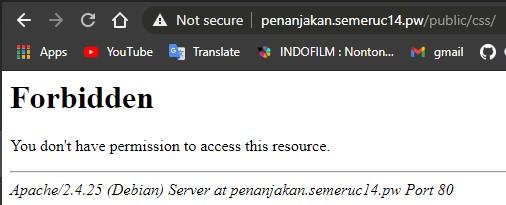

# Jarkom_Modul2_Praktikum_C14
### M Ridho Daffa Ardista 05111840000065
### Rifki Aulia Irawan 05111840000142

### 1. Alamat http://semeruc14.pw yang diatur DNS-nya pada MALANG dan mengarah ke IP Server PROBOLINGGO
Jawab :
1. nano /etc/bind/named.conf.local
2. Tambahkan konfigurasi :  
  
3. mkdir /etc/bind/semeruc14
4. cp /etc/bind/db.local /etc/bind/semeruc14/semeruc14.pw
5. nano /etc/bind/semeruc14/semeruc14.pw
6. Tambahkan konfigurasi :  
  
7. Service bind9 restart

### 2. Alias http://www.semeruc14.pw
Jawab :
1. nano /etc/bind/semeruc14/semeruc14.pw
2. Tambahkan konfigurasi :  
```www     IN	    CNAME	   semeruc14.pw.```  
  
3. Service bind9 restart

### 3. Subdomain http://penanjakan.semeruc14.pw
Jawab :
1. nano /etc/bind/semeruc14/semeruc14.pw
2. Tambahkan konfigurasi :  
```penanjakan	IN	A	10.151.77.124```  
  
3. Service bind9 restart

### 4. Reverse main domain 
Jawab :
1. nano /etc/bind/named.conf.local
2. Tambahkan konfigurasi :  
```
zone "77.151.10.in-addr.arpa" {
    type master;
    file "/etc/bind/semeruc14/77.151.10.in-addr.arpa";
};
```  
  
3. cp /etc/bind/db.local /etc/bind/semeruc14/77.151.10.in-addr.arpa  
4. nano /etc/bind/semeruc14/77.151.10.in-addr.arpa  
5. Tambahkan konfigurasi :  
  
6. Service bind9 restart

### 5. DNS Server Slave pada MOJOKERTO
Jawab :
uml MALANG :
1. nano /etc/bind/named.conf.local
2. Tambahkan konfigurasi :  
```	
also-notify { 10.151.77.123; };
allow-transfer { 10.151.77.123; };
```  
  
3. Service bind9 restart

uml MOJOKERTO :
1. nano /etc/bind/named.conf.local
2. Tambahkan konfigurasi :  
  
3. Service bind9 restart

### 6. Subdomain dengan alamat http://gunung.semeruC14.pw yang didelegasikan pada server MOJOKERTO dan mengarah ke IP Server PROBOLINGGO.
Jawab :
uml MALANG :
1. nano /etc/bind/semeruc14/semeruc14.pw
2. Tambahkan konfigurasi :  
```
ns1		IN	A	10.151.77.123
gunung	IN	NS	ns1
```  
  
3. nano /etc/bind/named.conf.options
4. Tambahkan konfigurasi :  
  
5. Service bind9 restart

uml MOJOKERTO :
1. nano /etc/bind/named.conf.local
2. Tambahkan konfigurasi :  
  
3. nano /etc/bind/named.conf.options
4. Tambahkan konfigurasi :  
  
5. mkdir /etc/bind/delegasi
6. cp /etc/bind/db.local /etc/bind/delegasi/gunung.semeruc14.pw
7. nano /etc/bind/delegasi/gunung.semeruc14.pw
8. Tambahkan konfigurasi :  
  
9. Service bind9 restart

### 7. Subdomain dengan nama http://naik.gunung.semeruc14.pw.
Jawab :
uml MOJOKERTO :
1. nano /etc/bind/delegasi/gunung.semeruc14.pw
2. Tambahkan konfigurasi :   
```	naik	IN	A	10.151.77.124 ```  
  
3. Service bind9 restart

### 8. Domain http://semeruc14.pw memiliki DocumentRoot pada /var/www/semeruc14.pw.
Jawab :
1. cd /etc/apache2/sites-available
2. cp /etc/apache2/sites-available/000-default.conf /etc/apache2/sites-available/semeruc14.pw.conf
3. nano /etc/apache2/sites-available/semeruc14.pw.conf
Tambahkan konfigurasi :  
  
4. a2ensite semeruc14.pw
6. wget 10.151.36.202/semeru.pw.zip
7. unzip semeru.pw.zip -d /var/www
8. mv /var/www/semeru.pw /var/www/semeruc14.pw
9. service apache2 restart

### 9. Mengaktifkan mod rewrite agar URL berubah menjadi http://​semeruc14.pw​/home
Jawab :
1. Aktifkan module rewrite dengan menjalankan perintah a2enmod
2. edit .htaccess pada /var/www/semeruc14.pw
3. tambahkan konfigurasi :  

4. jalankan service apache2 restart
5. Buka semeruc14.pw/home, maka akkan tampil halaman seperti berikut  


### 10. Web ​http://penanjakan.semeruyyy.pw​ akan digunakan untuk menyimpan assets file yangmemiliki ​DocumentRoot ​pada ​/var/www/​penanjakan.semeruc14.pw​ ​dan memiliki struktur folder sebagai berikut:
/var/www/penanjakan.semeruc14.pw  
/public/javascripts  
/public/css  
/public/images  
/errors  
Jawab :
1. Copy file 000-default.conf menuju penanjakan.semeruc14.pw.conf
2. Tambahkan konfigurasi pada file penanjakan.semeruc14.pw.conf seperti berikut  
```ServerName penanjakan.semeruc14.pw```  

3. jalankan a2ensite penanjakan.semeruc14.pw
4. jalankan service apache2 restart
5. download file pendukung untuk web penanjakan.semeruc14.pw yang disediakan di soal, kemudian unzip
6. rename file menjadi penanjakan.semeruc14.pw
7. jalankan service apache2 restart
8. coba buka penanjakan.semeruc14.pw, lalu akan muncul halaman dibawah  


### 11. Pada folder /public dibolehkan directory listing namun untuk folder yang berada di dalamnya tidak dibolehkan.
Jawab :
1. nano /etc/apache2/sites-available/penanjakan.semeruc14.pw.conf
2. tambahkan konfigurasi seperti berikut
```
<Directory /var/www/penanjakan.semeruc14.pw/public>
    Options +Indexes
</Directory>

<Directory /var/www/penanjakan.semeruc14.pw/public/*>
    Options -Indexes
</Directory>
```  
  
3. jalankan service apache2 restart
4. buka website penanjakan.semeruc14.pw dan coba buka masing-masing direktori yang ada, jika direktori public bisa diakses, dan css,javascripts,dan images tidak dapat diakses, maka berhasil.  
  
  
  


### 12. Untuk mengatasi HTTP Error code 404, disediakan file 404.html pada folder /errors untuk mengganti error default 404 dari Apache.
Jawab :
*(untuk penanjakan.semeruc14.pw)*
1. nano penanjakan.semeruc14.pw.conf
2. Tambahkan konfigurasi berikut  
```ErrorDocument 404 /errors/404.html```  
  
3. jalankan service apache2 restart
4. buka penanjakan.semeruc14.pw/asalaja, jika muncul tampilan seperti ini, maka sudah berhasil  


### 13. Untuk mengakses file assets javascript awalnya harus menggunakan url http://penanjakan.semeruc14.pw/public/javascripts. Karena terlalu panjang maka dibuatkan konfigurasi virtual host agar ketika mengakses file assets menjadi http://penanjakan.semeruc14.pw/js.
Jawab :
1. nano penanjakan.semeruc14.pw.conf
2. tambahkan konfigurasi berikut  
```Alias "/js" "/var/www/penanjakan.semeruc14.pw/public/javascripts"```  
  
3. buka direktori javascripts pada penanjakan.semeruc14.pw
4. jalankan touch app.js
5. jalankan service apache2 restart
6. buka pada browser penanjakan.semeruc14.pw/js, jika muncul seperti gambar berikut, maka sudah berhasil.  


### 14. Sedangkan web http://naik.gunung.semeruc14.pw sudah bisa diakses hanya dengan menggunakan port 8888. DocumentRoot web berada pada /var/www/naik.gunung.semeruc14.pw.
Jawab :
1. copy file 000-default.conf pada naik.gunung.semeruc14.pw.conf
2. buka file naik.gunung.semeruc14.pw.conf
3. pada bagian ```VirtualHost``` ganti portnya menjadi 8888, dan tambahkan konfigurasi berikut untuk mengganti documentroot menjadi /var/www/naik.gunung.semeruc14.pw  
  
 4. nano /etc/apache2/ports.conf
 5. tambahkan konfigurasi dibawah  
 ```Listen 8888```  
   
 6. pindah ke direktori /var/www, lalu download file pendukung untuk website naik.gunung.semeruc14.pw, lalu unzip
 7. rename file menjadi naik.gunung.semeruc14.pw
 8. jalankan a2ensite naik.gunung.semeruc14.pw
 9. jalankan service apache2 restart
 10. buka naik.gunung.semeruc14.pw pada broser, jika muncul seperti gambar dibawah, maka berhasil
   
 
 ### 15. Dikarenakan web http://naik.gunung.semeruc14.pw bersifat private, harus membuat web http://naik.gunung.semeruc14.pw agar diberi autentikasi password dengan username “semeru” dan password “kuynaikgunung”
 Jawab :
 1. tambahkan konfigurasi berikut pada pada 000-default.conf
 ```
 <Directory "/var/www/naik.gunung.semeruc14.pw">
    AuthType Basic
    AuthName "Restricted Content"
    AuthUserFile /etc/apache2/.htpasswd
    Require valid-user
 </Directory>
 ```  
   
 2. pada file /etc/apache2/apache2.conf, cari directory tag yang bertujuan ke /var/www, lalu ubah AllowOverride dari None ke All  
   
 3. jalankan ```htpasswd -c .htpasswd semeru``` untuk membuat username dan password, lalu masukkan password dan usernamenya
 4. tambahkan konfigurasi pada /var/www/naik.gunung.semeruc14.pw/.htaccess
 ```
 AuthType Basic
AuthName "Restricted Content"
AuthUserFile /etc/apache2/.htpasswd
Require valid-user
```
  
5. jalankan service apache2 restart
6. buka naik.gunung.semeruc14.pw:8888 pada browser, jika muncul seperti gambar dibawah, maka berhasil  
  
7. masukkan username dan password, jika benar maka akan masuk ke halaman berikut  


### 16. Karena dirasa kurang profesional, maka setiap Bibah mengunjungi IP PROBOLINGGO akan dialihkan secara otomatis ke http://semeruc14.pw.
Jawab :
1. tambahkan konfigurasi berikut pada file /etc/apace2/sites-available/000-default.conf
```
Redirect / "http://semeruc14.pw/"
```  
  
2. ketikkan IP Probolinggo pada browser, jika muncul halaman seperti berikut, maka sudah berhasil  
  

### 17. Karena pengunjung pada /var/www/penanjakan.semeruc14.pw/public/images sangat banyak maka semua request gambar yang memiliki substring “semeru” akan diarahkan menuju semeru.jpg.
Jawab :
1. nano /var/www/penanjakan.semeruc14.pw/.htaccess
2. Tambahkan konfigurasi :  
```
RewriteCond %{REQUEST_URI} !^/public/images/semeru.jpg
RewriteCond %{REQUEST_URI} ^/public/images/(.*)semeru(.*).jpg
RewriteRule ^ http://penanjakan.semeruc14.pw/public/images/semeru.jpg
```  
  
3. service apache2 restart  
  
  ### Kendala selama pengerjaan :
  1. Takut terkena segfault.
  2. Terkadang bingung untuk backtracking kesalahan dimana.
